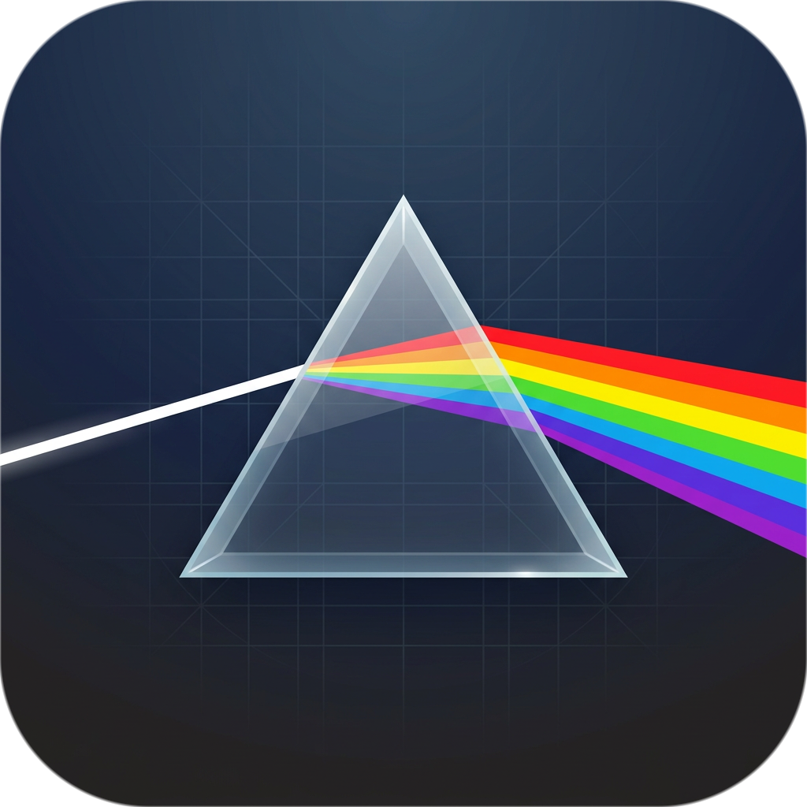

# Prism 棱镜



对标 Reqable / Charles 的 macOS 抓包调试工具（Electron），配套 Android VPN 客户端（分应用代理 + Root 证书注入）。在局域网内用 Mac 抓取本机与手机的全量流量，集**调试**（断点 / 重写 / 重放 / 弱网）、**API 测试**（Composer）、**解码扩展**（JS / Python 插件）与 **AI 集成**（内置 MCP 服务器）于一体。

## 特性

**抓包核心**
- HTTP/1.1、HTTP/2、HTTPS MITM（自建 CA / 叶子证书 / SSL bypass）、透明模式
- SOCKS5 入站（RFC1929 用户名携带 App 名，手机流量按应用归属）
- WebSocket 时间线、gRPC 解码 + trailers、gzip / br 自动解码
- 上游代理（二级代理）、反向代理、域名镜像、访问控制（IP 白/黑名单）
- 请求跟踪（`X-Trace-Id`）、请求时序瀑布（DNS/TCP/TLS/TTFB/下载细分）

**流量列表与调试**
- 虚拟滚动、列自定义、多 Tab 详情、键盘导航（`j/k/↑↓/⌘F/Esc`）
- 过滤语法：`host: path: method: status: app: ip: sni: label: note: trace: body: has: flag:` + 纯文本
- 断点（请求/响应拦截编辑）、规则引擎（mock / map-local / rewrite / block / hold / throttle / bypass-tls）
- 多选、彩色高亮、批量重放、任意两条流量 diff、标签备注
- 一键网络模拟（弱网/2G/3G/4G/断网预设）、无痕模式、极速模式（仅内存不落盘）

**Composer（API 测试）**
- 多 tab + 草稿持久化、参数/请求头/请求体/授权/前置脚本五 tab
- 8 种 body 格式、表格⇄文本模式、环境变量 `{{var}}`、Cookie 按域注入、请求历史
- 导入/导出 cURL、生成多语言代码（cURL / Python / fetch / axios / Go）

**数据与扩展**
- HAR 导入/导出；集合导入：Postman v2.x、OpenAPI 3.0 / Swagger 2.0、Hoppscotch
- 插件系统：JS worker 隔离 + Python 子进程桥，支持历史流量手动解码
- 工具箱：编解码 / Hash / HMAC / AES-256-GCM / 时间戳 / UUID / 正则 / 二维码
- 主题：暗/亮/跟随系统 + 强调色 + 代码配色 + 自定义 CSS 变量面板

**AI 集成**
- 内置 MCP 服务器（Streamable HTTP，默认关闭）：`http://127.0.0.1:9092/mcp`
  工具：`list_flows` / `get_flow` / `get_flow_body`

**Android 客户端**
- 分应用 VPN、开机自启、扫码配对（Wi-Fi / USB adb-reverse 双方案）
- Root 证书注入（su / 内核魔数双模式），Android 14+ apex 证书 bind-mount

## 仓库结构

```
packages/shared/src/   IPC 契约与全端类型
packages/core/src/     抓包引擎（可脱离 Electron 独立运行，CLI 同源）
  ├ index.ts           ProxyCore 门面
  ├ server/            MITM + SOCKS5 入站、规则、弱网、镜像、反向代理、上游代理
  ├ db/                flows 落库（SQLite）+ 过滤 SQL + 保留策略
  ├ mcp/               内置 MCP 服务器
  └ certs/ plugins/ export/ capture/
packages/ui/src/       React 19 + zustand + 虚拟滚动前端
src/main/              Electron 主进程 IPC
src/preload/           contextBridge
android/               VPN App（VpnService + vendored hev-socks5-tunnel + JNI）
docs/使用文档.md        详细使用手册
```

## 环境要求

- macOS（arm64 / x64），Node.js ≥ 22（需内置 `node:sqlite`）
- Android 构建：JDK 21 + Android SDK（NDK 用于 vendored tun2socks）
- Python 解码插件依赖系统 `python3`（不打进安装包）

## 快速开始

```bash
npm install

# 开发模式（渲染层 HMR；改 core/main/shared 需重启）
npm run dev
# 带 CDP 远程调试（E2E 用）：
npx electron-vite dev --remoteDebuggingPort 9222

# 生产构建（仅打包代码到 out/）
npm run build

# headless CLI（不启 UI）
npm run cli

# 类型检查 / 测试
npm run typecheck
npm test
```

### 打包 macOS 安装包

```bash
npm run dist:mac        # 生成 dist/Prism-<ver>-arm64.dmg
npm run dist:mac:app    # 只生成 .app 目录（更快，自用足够）
```

未做代码签名：首次打开请右键「打开」，或执行 `xattr -cr /Applications/Prism.app` 绕过 Gatekeeper。

### Android

```bash
cd android && ./gradlew assembleDebug
adb install -r --no-streaming app/build/outputs/apk/debug/app-debug.apk
```

> 部分机型（如 OPPO/一加）流式安装会触发平台 bug，务必加 `--no-streaming`。

## 端口与数据目录

| 端口 | 用途 |
|---|---|
| 9090 | HTTP 代理 |
| 9091 | SOCKS5 代理 |
| 9092 | MCP 服务器（默认关闭，设置中开启） |
| 9222 | CDP 远程调试（仅 dev 显式开启时） |

数据目录（证书 / SQLite / 插件 / bodies）：
- GUI：`~/Library/Application Support/<appName>/data/`
- CLI：`$PRISM_DATA_DIR` 或 `~/.prism`

首次运行会生成自签 CA（`data/certs/ca.pem`）。Mac 需在「设置 → 证书信任」信任；手机通过 App 内 Root 注入或手动安装。

## 文档

- 详细使用手册与 FAQ：[`docs/使用文档.md`](docs/使用文档.md)

## 许可

[MIT](LICENSE)。vendored 第三方组件（hev-socks5-tunnel）署名见 [NOTICE](NOTICE)。

安全漏洞请私下邮件报告，见 [SECURITY.md](SECURITY.md)。
